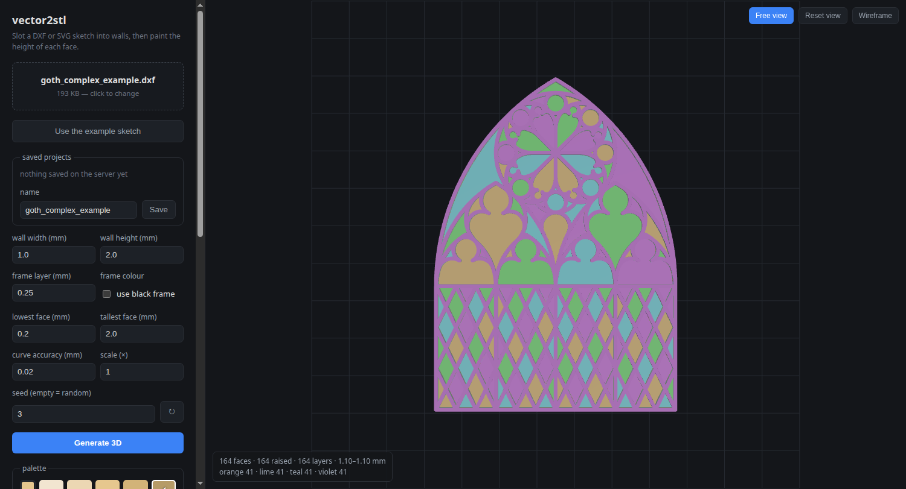

# vector2stl

Turn a 2D sketch into a 3D relief STL. Every curve becomes a
raised *wall*, and every face enclosed by those walls is extruded to its own
height — either rolled at random or painted by hand from a colour palette.

The sketch can be a **DXF**, an **SVG**, or — starting from a **photo or scan
of a hand-drawn sketch** — traced to an SVG right in the page first.



## The workflow

The app is three full-screen steps, each using the whole window:

**Start** — the landing screen. Pick how you begin:

- **Trace a photo** — upload a `.png` / `.jpg` / `.gif` / `.webp` photo or scan
  of a sketch.
- **Open SVG / DXF** — start from an existing vector drawing.
- **Open a project file** — reopen a downloaded `.v2sproj`.
- **Saved projects** — the grid below lists everything saved on the server,
  with a thumbnail each. Click one to reopen it; **⧉ duplicates** it and **✕**
  deletes it. **Example sketch** loads the bundled gothic window.

**Trace** — full screen, used only when you start from a photo. The left side
holds the trace settings (centerline vs outline, threshold, simplify,
smoothing, skeletonize, invert, speck removal); the right side is a large live
preview with **SVG · Original · Overlay** views. **Create 3D model** hands the
traced SVG to the builder.

**3D model** — the relief builder: walls, sizes, palette, painting, holes,
boundary, and export. A **← Start** button returns to the landing screen. When
the drawing came from a trace, an **Edit trace** button is always available to
jump back and re-tune it — including for projects reopened later, which keep
the source photo and its trace settings.

From the 3D step the flow is unchanged: tune the wall sizes and *y size*,
**Generate 3D**, paint the faces, and export STL or 3MF.

Two trace modes matter for what you get downstream:

- **centerline** (the default) turns line art into thin open strokes — in the
  relief those become **walls** but enclose no faces to paint.
- **outline** follows the edges of filled shapes — closed loops that become
  **paintable faces**.

So a drawing of enclosed shapes (flower petals, window panes) traces as
*outline*; a loose pencil sketch traces as *centerline*. The trace's stroke
width is cosmetic — the relief reads the outlines, not the stroke.

## Running it

```bash
deno task start          # http://localhost:8788
```

That's the whole setup. The first run creates `.venv` and installs the Python
packages from `requirements.txt` (a few seconds); later runs skip straight to
the server. Editing `requirements.txt` re-installs on the next start.

You need Deno and Python 3 with the `venv` module — on Debian/Ubuntu that's
`sudo apt install python3-venv`.

`deno task dev` restarts on file changes, `deno task check` type-checks, and
`deno task setup` prepares `.venv` without starting the server.

Open the page and pick a starting point on the **Start** screen (trace a photo,
open a drawing or a project, or use the example). Tune the sizes in the 3D
step and press **Generate 3D**. The browser gets the face outlines and extrudes
them itself, so painting is instant — nothing goes back to the server until
you save.

## Painting the faces

The palette has **three** base hue rows and one brightness level per *print
layer* of height. The levels run **brightest = lowest** to **darkest =
tallest**, so a face's shade always tells you how far it stands proud. Under
them sit the **mixes** — see below.

How many shades a row has follows from *layer height* and the *lowest face* …
*tallest face* range: with the defaults — 0.2 mm layers over 0.20 to 1.00 mm —
that is five, at 0.20, 0.40, 0.60, 0.80 and 1.00 mm. Every one of them is a
whole number of layers, so there is no height in the palette the printer cannot
stop at. The range starts at 0.20 — a single layer — because anything thinner
is too thin to print as a face of its own.

Halve the layer height and you get twice the shades. A row tops out at twenty;
a range too tall for that steps several layers at a time instead (0.20 … 8.00 mm
at 0.1 mm layers becomes seventeen shades 0.5 mm apart). The ends of the range
are themselves rounded to the nearest layer.

Typing into *selected face height* rounds to the nearest layer too, and says so
when it does.

Pick a swatch, then use the mouse on a face in the view:

| Button | What it does |
| --- | --- |
| **left** | that face becomes just this swatch |
| **right** | stacks the swatch on top of what is there |
| **middle** | peels the top layer back off |

Hover a face and a card follows the cursor with that face's stack drawn out:
a bar of its layers, bottom one at the bottom, each in its own shade and sized
by its thickness, beside the list of what they are — `teal · 0.30 mm` — and the
face's area and total height. The bar is drawn against the full *tallest face*
range, so a low face is a stub and a tall one nearly fills the track and the two
can be told apart without reading a number; paint a face taller than the range
and it sets the scale itself. The card follows every click, so stacking a layer
shows up in it straight away, and it steps out of the way while you orbit or
place a hole.

So picking hue 1 at 0.30 mm and left-clicking a face, then picking hue 3 at
0.60 mm and right-clicking the same face, leaves a face 0.90 mm tall made of a
0.30 mm layer with a 0.60 mm layer on it. Each palette height is the *thickness*
of the layer it adds. A face always keeps its bottom layer — middle-clicking the
last one does nothing; left click to recolour it instead. Selecting a swatch
only arms the colour, so it never disturbs a stack you have already built.

Each base row starts with a colour picker: change it and that row — and every
face already painted with it — takes the new hue. Only the hue is taken from
your choice; the brightness steps are re-derived, because brightness has to go
on meaning height. A grey has no hue, so it is refused rather than silently
turning the row red. Exported file names follow whatever hue a row is on.

### Mixes

Under the base rows are the three pairings the three hues allow — **1 under 2**,
**2 under 3**, **3 under 1** — so each hue is the lower layer of one mix and the
upper layer of another. A mix swatch is split in two the same way: the lower
hue across the bottom, the upper one on top, which is the one you see looking
straight down at the print.

Painting with a mix lays down **two** layers of equal thickness rather than one,
so it has half the steps a base row does: each half has to be a printable height
in its own right *and* the two together have to fit under the tallest face. With
the defaults that is four mixes — 0.40, 0.60, 0.80 and 1.00 mm total, the
figures on the scale under them — against nine plain shades. Set a tallest face
too low for two layers and the mixes step aside with a note saying so.

Nothing else treats a mix as special: it is an ordinary two-layer stack, so
right-clicking one stacks both its layers, middle-click peels them off one at a
time, and each layer exports to its own colour's file. The mixes need no
filament of their own.

| Control | What it does |
| --- | --- |
| selected face height | exact thickness for the top layer of the selected face |
| **Fill all** | gives every face the selected swatch |
| **Random all** | random base hue and height for every face |
| **Random heights** | new heights for every face, leaving the colour scheme alone |
| **Mirror ⇄** | copies the left half's colours onto the right, reflected through the middle |
| **Top view** | locks the camera straight down and stops orbiting, so clicks can't spin the model |
| **↻** (seed) | rerolls the starting heights |

Mirroring pairs faces by reflected centroid and only accepts a pair when the
areas agree too; it reports any face that had no partner rather than guessing.

## Stacked drawings

One drawing is the usual case, but you can stack several: **add drawing…**
under *drawings* picks another DXF or SVG and puts it on its own **layer** —
a complete model of its own, frame and faces, sitting **on top of the frame
of the layer below** and centred on it horizontally. Dropping a second file
on the page asks whether to add it as a layer or start over.

Every layer shares the one palette: three hues, one brightness scale, the
same mixes. Painting is per face wherever it sits — click a face on any layer
and it takes the swatch; **Fill all** and **Random all** paint every layer at
once. The checkbox on each layer's row hides it, which is how you reach a
lower layer's faces once a taller stack is in the way.

Because the colours are shared, exporting never grows: three hues and a solid
frame still come out as three colour STLs plus `walls.stl`, each file holding
its colour's pieces from **every** layer, already aligned on top of each
other. The 3MF likewise keeps its extruder count.

Each layer keeps its own DXF-sublayer selection, its own mounting holes, and
its own scale — every drawing is fitted to the shared *y size* on its own.
Wall sizes, the palette range, the sweep profile and the seed are shared by
all layers: change them and every layer rebuilds together. Projects with
several layers save as version 2 and reopen with the stack intact; a single
layer saves exactly as before.

A layer's height is the frame height of everything under it, so a face you
paint *taller than the frame* pokes into the layer above — keep face heights
under the wall height when stacking.

## Settings

| Setting | What it does |
| --- | --- |
| wall width | thickness of the ribbon each curve is buffered into |
| keep walls inside the outline | trace the outermost lines along the inside of the wall, so the model comes out no wider than the drawing |
| wall overlap | how far each face reaches into the wall around it, so the two fuse when printed |
| wall height | how tall the walls stand |
| layer height | what your slicer prints in; every palette shade is a whole number of these |
| lowest / tallest face | the ends of the palette's height range |
| curve accuracy | max chord error when flattening arcs, circles and splines |
| y size | how tall the finished model is in mm, walls included; the width follows the drawing's proportions |
| scale | what the y size works out to — set it yourself to scale by hand instead |
| seed | fixes the starting heights so a result is reproducible |
| layers | which layers to read; shown when a drawing has more than one |

Once a model is on screen every one of these applies **as soon as you leave the
box** — tab out, press Enter, or click the spinner arrows — and the model comes
back rebuilt but still painted. Only the geometry is redrawn: heights and hues
are never rerolled behind your back, which is what the seed, **↻** and the
*Random* buttons are for. Changes made while a rebuild is running collapse into
a single extra pass rather than piling up.

*Lowest* / *tallest face* need no rebuild at all — the outlines do not depend on
them, so only the palette and the shading change. A face painted at 0.7 mm is
still 0.7 mm; it just sits at a different point of the range.

The one thing that cannot survive is a change to the *number* of faces: widen
the walls far enough that two faces merge and there is nothing to map the old
painting onto, so it says so and starts fresh.

## Scripting the faces

**Callback…** opens a code editor (Monaco, from a CDN — a plain text box if it
cannot be reached). The script runs *once* with the whole set of faces, so the
loop is yours to write: sort, group or bucket them however you like before
deciding what each one becomes.

```js
faces    // [{ id, area, centroid: [x, y], height, stack }]
stack    // [{ hue, t }] bottom layer first — hue is 0..2, t is mm thick
levels   // every palette height, lowest first — as many as the layer height gives
hues     // the three hue angles, in degrees
```

**Load a template…** in the header drops in a working starting point:

| Template | |
| --- | --- |
| Do nothing (default) | the bare loop, changes nothing |
| Random single hue | one layer per face, random colour and height |
| Random stacks | one to three random layers per face |
| Hue by rotation | cycle the palette rows in face order |
| Colour by area | rank by size, a hue and height per band |
| Height by area | bigger faces stand taller, colours untouched |
| Radial rings | rings stepping out from the middle |
| Vertical gradient | low at the foot of the drawing, tall at the top |
| Checkerboard | two colours alternating over a 10 mm grid |
| Cap the tall ones | crown whatever already stands high — builds on the current state |
| Flatten | everything back to one thin layer |

Picking one replaces the editor's contents, asking first if you had written
something of your own. Assign to `face.stack` to repaint — colouring by size,
for instance:

```js
const sorted = [...faces].sort((a, b) => b.area - a.area);
sorted.slice(0, 10).forEach(f => f.stack = [{ hue: 0, t: levels[0] },
                                            { hue: 2, t: levels[levels.length - 1] }]);
sorted.slice(10).forEach(f => f.stack = [{ hue: 1, t: levels[1] }]);
```

The script works on copies. If it throws, or hands back a layer with a hue out
of range or a thickness that is not a number, the error is shown and **nothing**
is applied — the model is never left half-changed. Ctrl+Enter runs, Esc closes,
and the code is remembered and saved with the project.

The script is your own code running in your own browser with no sandbox, which
is the point — but it does mean a callback pasted from elsewhere can do anything
the page can.

## The frame

By default the frame is **one solid in its own colour** — *use black frame* is
on — and exports as its own `walls.stl` on its own extruder.

Turn it off and the frame is built instead from thin layers cycling through the
palette's three hues until it reaches the wall height — five 0.2 mm layers for a
1 mm frame — so it prints from filaments you have already loaded, no extruder of
its own needed.

| Control | |
| --- | --- |
| use black frame | one solid in its own colour (the default) |
| frame layer (mm) | with it off, the thickness of each band; 0.2 mm is a typical print layer |

Three base hues plus a solid frame is **four** extruders, which is what a
Snapmaker holds — the mixes need no filament of their own, since they are built
from hues already loaded. The 3MF export still counts them and says so if a
model ever needs more.

The mixed frame reads as a dark edge from the side, where all three colours are
in view. Straight down from above you see only the **topmost** layer, so that
band's colour is what the frame's top surface will be — change *frame layer* to
land the last band on the hue you want.

It is not free: each band is a full extrusion of the wall outline, so the frame
costs one solid per band — a 2 mm frame in 0.2 mm layers is roughly ten times
the frame triangles, which on the gothic example took the STL from 2.9 MB to
16 MB. Slicers cope; it is only worth knowing before you wonder where the size
came from.

## Wall overlap

Geometrically the faces fit the frame exactly, sharing a wall with nothing to
spare. Printed, that shared edge is a bare vertical seam: a face only 0.2 mm
tall is a couple of layers held in place by nothing, and it drops out of the
frame.

*wall overlap* (default **0.1 mm**) grows every face outwards into the wall
around it, so the two solids overlap and the slicer has material to fuse across
the join. It costs a little geometry — 0.1 mm on the gothic example takes the
STL from 57k to 71k triangles — and nothing else:

- the outside of the model does not move; the growth is clipped to the
  silhouette, so a face on the edge of the drawing cannot spill past the frame's
  outer face
- face ids are settled before it is applied, so changing it never renumbers
  what you have painted — the page re-fits the faces on the spot and keeps the
  colours
- it must stay under **half** the wall width, or the faces either side of a
  wall would meet inside it; the converter refuses anything more
- a face standing as tall as the frame shows a thin rim of its own colour on
  the frame's top surface, which is the one place the overlap is visible

Set it to `0` for the exact fit.

## Keeping the walls inside the outline

A curve is traced down the **middle** of its wall, so the frame stands half a
wall width outside the drawing: a 100 mm square walled 10 mm wide comes off the
printer 110 mm across. That is usually what you want — the drawing is the
skeleton and the wall hangs on it either side.

Tick **keep walls inside the outline** and the outermost line becomes the edge
of the model instead. That curve is moved half a wall width inwards, everything
else is trimmed to stay behind it, and the same square comes out at exactly
100 mm — walls still 10 mm thick, opening 80 mm. Use it when the drawing *is*
the finished size: a part that has to fit a 100 mm slot, a tile that has to butt
against its neighbour.

Only the outside moves:

- curves inside the drawing keep running down the middle of their walls, and a
  shape sitting inside another one — an island in a face — is left alone; it has
  nothing to do with how wide the model prints
- a shape with no room to pull a wall into is left as drawn: an open stroke has
  no inside, and neither has anything thinner than the wall itself
- it applies to a swept profile too, which is confined by its own width
- *y size* stops counting the walls, since they no longer stick out; the scale
  is re-fitted the moment you tick the box

The frame is a round-ended ribbon, so a sharp outer point comes out a fraction
short of the line rather than over it — the wall cannot both keep its thickness
and reach into a corner tighter than itself. Faces close to the outer wall lose
the strip it now occupies, and thin ones can vanish into the frame entirely,
which renumbers the faces and starts the painting fresh.

## Sweep profile (advanced)

By default the frame is not flat: the bundled **`default_profile.dxf`** — a
small triangular moulding — is loaded when the page opens and swept along every
curve of the drawing, the way a CAD sweep runs a profile along a path. The
profile row under the wall settings shows what is loaded; **sweep profile…**
picks a different DXF or SVG, and the row's ✕ goes back to flat walls (the
classic behaviour: every curve buffered to *wall width* and extruded to *wall
height*). The example under `advanced_profile_sweep/` (a triangular section on
a gothic window) shows the shape of it.

**profile width (×)** stretches the section sideways — ×2 doubles the frame's
width while its height stays as drawn.

The profile drawing's own axes become the sweep's: **x runs across the path**,
**y is the height**. It is re-anchored to the centre of its base — draw the
section sitting on the x axis, centred on the origin, and it lands on the path
exactly. Loose entities are fine: the outline is rebuilt from whatever closes
into a ring, and construction lines inside it are ignored. The profile is used
at the millimetres it was drawn in — it never scales with the drawing.

While a profile is set:

- its width and height take over from *wall width* and *wall height* (the
  boxes grey out); the faces, the *y size* fit and the palette keep working
  against those dimensions, so painting is unchanged
- the frame is always **one solid in its own colour** — the palette-cycled
  frame layers are hidden, a sloped moulding has no flat bands to paint
- **mounting holes are off**: cutting them would need a mesh boolean the
  converter does not have, and placing one is refused

Corners are mitred — a pointed arch comes to a real point — up to a limit of
twice the offset; sharper cusps are bevelled rather than spiking. Curves that
meet end-to-end are chained into continuous paths first (the straightest
continuation wins at a junction), and duplicate strokes are swept once.

Projects carry the profile and its width scale, so a saved sweep reopens as
one.

## Cropping to a boundary

Drop a **second** drawing — a closed polygon — and it **bounds** the pattern:
everything that lies outside it is cut away. This is how a pattern becomes a
leaf, a badge, a pendant or a window shape instead of a full sheet of it.

- **boundary…** (under *drawings*) picks the polygon. It is read in the
  pattern's *own coordinates* and scaled with it, so draw it over the pattern
  in the same file and it lands exactly where you drew it. The ✕ goes back to
  the whole drawing. Loading one sets *scale* to **×1 in the boundary's own
  units** — the part comes out at exactly the size the boundary file says.
- **centre & fit to the pattern** (on by default) re-anchors the boundary for
  files that do not share a coordinate system: the polygon is centred on the
  pattern's box and scaled uniformly — never stretched — until it just fits
  inside it. This is what makes a boundary exported from one CAD tool crop an
  SVG pattern exported from another. Turn it off to keep the boundary exactly
  where it was drawn.
- **wall along the boundary** (on by default) turns the boundary into a wall
  of its own, so the cropped pattern comes out with a rim and every face along
  the cut is enclosed like any other. Turn it off for a **flush cut**: faces
  the boundary crosses are trimmed to it, but end open at the cut edge.
- **boundary size (×)** resizes the polygon about its own centre, and
  **nudge x / y** slides it over the drawing in finished millimetres — the two
  together place a crop by eye when it was not drawn exactly where you want it.
- **use boundary size (1:1)** puts the scale back on ×1 in the boundary's own
  units — the exact size the boundary DXF or SVG was drawn at — with the
  pattern scaled to whatever fills it. It is the quick way back after the
  *y size* or *scale* boxes have moved you off it.
- **window content** is the pattern seen through the frame: **content size (×)**
  resizes it about its own centre and **content x / y** slide it under the
  boundary in finished millimetres, while the boundary keeps its size. Where
  the boundary controls move the *frame*, these move the *picture* behind it.
- **position window content…** opens a 2D preview of the frame and the pattern
  together. Drag to slide the content, scroll to resize it — both redraw
  instantly, without waiting for the 3D rebuild — then **Done** re-runs the
  model once.

With a boundary loaded, *y size* and *scale* fit the **crop**, not the
pattern — the boundary is the finished outline, and *scale* ×1 means the
boundary file's own units. The boundary is shared across stacked drawings,
applied to each at its own scale (and, when one is set, the base drawing's
scale so the nudge means the same place on every layer).

The polygon is read from every closed outline in its file — a circle is a
boundary, a rectangle is, and several shapes crop the pattern once each. An
outline drawn inside another one makes a hole in it, the way a filled shape
would: two concentric circles crop to a ring. Mounting holes still cut through
the result; a swept profile still forms the frame (its rim follows the
boundary). The boundary travels with a saved project, like the profile does.

There is no "freehand" boundary: an open stroke encloses nothing, and the
converter says so rather than guessing.

## Mounting holes

Holes are cut straight through the part, for hanging it once it is printed.
Set a diameter, press **Place hole**, then click where each one should go —
the mode stays on so you can place several. Each hole appears in a list with
its position, and a red ring marks it in the view.

The preview is re-cut on the server, so what you see is what the STL contains.
Face ids are fixed *before* holes are cut, which is why adding or removing a
hole never disturbs the heights and colours you have already painted — even
when a hole splits a face in two or swallows a small one whole.

## Saving and reopening a project

A project holds everything needed to pick the work back up: the drawing itself,
every setting, the layer selection, the palette's three hues, the frame choice,
every face's stack of coloured layers, the holes, and the callback script. There are two places to put one.

**On the server** — type a name under *saved projects* and press **Save**. It
lands in `projects/` next to the app and appears in the list; click a name to
reopen it, or ✕ to delete it (both saving over an existing name and deleting
ask first). This is the one to use day to day — no files to manage.

Each server save also stores a **thumbnail of the generated 3D model** — a
small render taken straight off the preview, painted faces included — so the
start screen's grid shows the relief itself, not just the flat drawing. A
project saved before its model was generated falls back to a flat render of the
drawing.

**As a file** — **Save project** downloads a `.v2sproj`. Drop it back on the
page to reopen. Use this to move work between machines or to keep a copy
outside the app.

Either way the drawing is embedded rather than referenced, so a project stands
alone. A drawing that was made by tracing a photo keeps its **source image and
trace settings** too, so reopening a project brings the trace step back with
them — tweak a knob and press **Use this trace** to re-commit. With several
stacked drawings the project holds every layer — its drawing, scale, sublayers,
faces and holes — and is written as format version 2; single-drawing projects
keep version 1, and both open in either direction. Face ids are derived from
the drawing and the wall settings; if a project no longer produces the same
number of faces, it says so and starts fresh instead of pinning colours to the
wrong faces.

Set `PROJECT_DIR` to keep the server's projects somewhere else. Project names
allow letters, digits, spaces, `.`, `_` and `-`, and must start with a letter or
digit — enough to keep a name from ever pointing outside that directory.

### Rescuing a session saved before this existed

`tools/recover-project.js` pulls a `.v2sproj` out of a tab that predates project
saving. Paste it into that tab's console — **without reloading** — then click a
save button; the state it sends is intercepted and written out as a project.

## How big it comes out

*y size* is the size control: **50 mm** by default, and the finished model is
that tall including the walls, which stand half their width outside the
outermost curve on each side — unless they are
[kept inside the outline](#keeping-the-walls-inside-the-outline), when the
drawing alone is the size. The width follows from the drawing's own
proportions — 50 mm of the example works out at 22.6 × 50.0 mm.

Drop a drawing in and it is fitted straight away, whatever units it was drawn
in, so an SVG in pixels needs no conversion. *scale* shows the multiplier that
came out of it (`×0.597459`); set that instead and *y size* follows, so the two
boxes always agree. Widening the walls re-fits the scale rather than quietly
making the model taller than the size you asked for.

Reopening a project keeps the scale it was saved with — the y size box does not
get to resize finished work.

## Saving the model

Downloads are named after the **project name**, not the drawing file: name it
`Rose Window v2` and you get `Rose Window v2.stl`, `Rose Window v2.3mf`,
`Rose Window v2-1-orange.stl` and so on, whatever `.dxf` it grew out of. The
name is suggested from the drawing when you first drop one in, and characters a
project name cannot hold become `-`.

- **Download STL** — one file containing the walls and every face, exactly as
  previewed.
- **Export 3MF (Snapmaker)** — a single 3MF holding every **colour
  combination**: the colour groups (which faces are printed together) stay put,
  while the colours trade places across them. A two-colour model has two
  combinations, three colours six, and so on — every permutation. Each
  combination is written as one merged object, laid out side by side on the
  plate. The frame keeps its own colour throughout. See *3MF* below.
- **Export STLs by colour** — one STL per hue, named for the hue in use
  (`…-1-orange.stl`, `…-2-teal.stl`, …), for multi-material printing. Each
  *layer* goes to its own colour's file, so a stacked face is split across them
  at the right heights. A solid frame adds `…-walls.stl`; a mixed frame has its
  bands filed under their own colours instead.
  Browsers ask for permission the first time a page saves several files at once.

## 3MF

A 3MF is a zip. The geometry is plain 3MF core — one `.model` per part under
`3D/Objects/`, each holding `<vertices>` and `<triangles>` — and the **colour
is not in the mesh at all**. It lives in `Metadata/model_settings.config`:

```xml
<object id="4">
  <metadata key="name" value="2-lime"/>
  <metadata key="extruder" value="2"/>     <!-- this is the colour -->
  <part id="3" subtype="normal_part"> … </part>
</object>
```

The export writes that flavour: the one Snapmaker's slicer (a Bambu Studio
fork) reads, with the production extension and a `[Content_Types].xml`,
`_rels/.rels` and `3D/_rels/3dmodel.model.rels` to match. Palette row *n*
becomes extruder *n*, so orange is extruder 1 and violet is extruder 3; a solid
frame takes the next one after those.

Every part is placed with the **same** transform, centred on the 270 × 270 bed,
so the colours stay registered on top of each other. This matters: importing
loose STLs makes the slicer centre each one independently, which pulls them out
of alignment — in the reference file this project was built from, the loose
colours sat up to 22 mm away from the frame.

No printer profile is written, so opening the file uses whatever printer and
filaments you already have selected rather than overriding them. Three hues and
a solid frame come to four extruders; turning the black frame off puts the
frame on the palette's own colours and brings that down to three.

The 3MF button writes **one file** containing every permutation of the palette
colours actually used — two colours, two combinations; three colours, six. Each
combination is a merged multi-colour object: the same colour groups exist in
each, but the extruder a group gets is swapped, so `orange-green` and
`green-orange` are the two ways a two-colour model can be loaded without
repainting. The frame (an unnumbered group) keeps its extruder in every
combination; only the numbered palette rows trade places.

## Input formats

A raster image is not read directly: it goes through the trace step first
(*The workflow* above), which turns it into an SVG, and that SVG is then read
like any other. The accepted rasters are `.png`, `.jpg`, `.jpeg`, `.gif` and
`.webp`.

Both vector readers produce the same thing — flattened polylines in millimetres
— so an SVG and the equivalent DXF give the same relief. There is no SVG-to-DXF
conversion step.

**DXF** — `LINE`, `ARC`, `CIRCLE`, `ELLIPSE`, `LWPOLYLINE`, `POLYLINE` and
`SPLINE`, with `INSERT` block references exploded. Layers come from the drawing.

**SVG** — `path` (all commands, including arcs and relative forms), `rect`
(incl. rounded), `circle`, `ellipse`, `line`, `polyline`, `polygon`, plus
`<use>` references. Transforms are applied, nested groups included. Groups name
the layers, using the Inkscape label when there is one, so the layer picker
works the same way. Hidden elements (`display:none`, `visibility:hidden`) are
left out. Only outlines matter — fills and strokes are ignored.

**Sizing.** SVG's y axis points down and the model's points up, so the drawing
is flipped for you. Lengths follow the SVG spec: a page declared in physical
units (`width="100mm"`) comes out at that size, and a unitless page is read as
CSS pixels at 96 dpi, so `100` becomes 26.46 mm. In the page none of that
matters — *y size* fits the drawing to the millimetres you want whatever it
was drawn in. On the command line, set `--scale` yourself; for a unitless page
meant to be millimetres, use `3.7795`.

## Command line

The converter runs standalone:

```bash
# raster -> SVG (the trace step), then SVG -> STL (the relief)
.venv/bin/python tools/trace.py --params trace.json photo.png > sketch.svg
.venv/bin/python tools/dxf2stl.py sketch.svg out.stl --scale 3.7795

.venv/bin/python tools/dxf2stl.py sketch.dxf out.stl --wall-width 1.0 --seed 7
.venv/bin/python tools/dxf2stl.py drawing.svg out.stl --scale 3.7795
.venv/bin/python tools/dxf2stl.py sketch.dxf --inspect     # layers + geometry counts
.venv/bin/python tools/dxf2stl.py sketch.dxf --regions     # face outlines as JSON

# heights.json: {"0": 1.1, "3": 0.2}   holes.json: [{"x": 12, "y": 80, "d": 4}]
# --wall-stack takes the same layer list for the frame
# stacks.json:  {"0": [{"t": 0.65, "g": "1-orange"}, {"t": 1.1, "g": "3-violet"}]}
.venv/bin/python tools/dxf2stl.py sketch.dxf out.stl --heights heights.json --holes holes.json
.venv/bin/python tools/dxf2stl.py sketch.dxf out.stl --stacks stacks.json
.venv/bin/python tools/dxf2stl.py sketch.dxf out_dir --stacks stacks.json --split
.venv/bin/python tools/dxf2stl.py sketch.dxf out.3mf  --stacks stacks.json
# keep the model inside its outermost line instead of straddling it
.venv/bin/python tools/dxf2stl.py sketch.dxf out.stl --wall-width 10 --confine-walls
# advanced: sweep a closed cross-section along every curve for the frame
.venv/bin/python tools/dxf2stl.py paths.dxf out.stl --profile profile.dxf --profile-scale 1.5
# advanced: bound the pattern with a closed polygon — everything outside is cut away
.venv/bin/python tools/dxf2stl.py sketch.dxf out.stl --boundary crop.dxf
# centre & fit the boundary instead of keeping it as drawn, then place it by eye
.venv/bin/python tools/dxf2stl.py sketch.dxf out.stl --boundary crop.dxf --boundary-fit \
    --boundary-scale 1.2 --boundary-x 2 --boundary-y -1
# a flush cut leaves the faces along the crop open instead of walling the boundary
.venv/bin/python tools/dxf2stl.py sketch.dxf out.stl --boundary crop.dxf --no-boundary-wall
# advanced: stack another drawing on top, centred on the base drawing —
# layer2.json: {"file": "other.dxf", "scale": 0.6, "layers": "A,B",
#               "stacks": {...}, "heights": {...}, "holes": [...]}
.venv/bin/python tools/dxf2stl.py sketch.dxf out.stl --also layer2.json
```

`trace.json` holds the trace settings — `traceMode` (`centerline` or
`outline`), `threshold`, `strokeWidth`, `simplify`, `smoothing`, `skeletonize`,
`invert` and `minArea`. The SVG comes out on stdout; a stats line (`paths`,
`nodes`) on stderr.

A face is a stack of layers, bottom first, each with a thickness `t` and a
colour group `g`; `--heights` is the shorthand for a stack one layer deep.
`--split` writes one STL per group into the output directory instead of a
single file; an output named `.3mf` writes a 3MF project instead.

`--also` is repeatable, in stacking order: each extra drawing is centred on
the base drawing and sits on the frame top of the one below it. Everything
but the drawing, its scale, its layers and its assignments is shared —
one wall size, one profile, one seed, and one set of colour groups, so
`--split` and 3MF exports merge the stacked layers into the same files.

A face's id is its index in `--regions` output. That order is pinned by area
then centroid *before* the overlap is applied, so the same drawing and wall
width always yield the same ids whatever the overlap is —
which is what lets the browser hand heights back by id. Faces left out of
`--heights` fall back to a seeded random height; a height of `0` leaves the
face open.

The reader is chosen from the file extension. Anything without an outline (text,
hatches, images) is skipped and reported. Stats go to stdout as JSON; problems
go to stderr.

## HTTP API

| Route | |
| --- | --- |
| `POST /api/trace/upload` | multipart `image` (.png/.jpg/.gif/.webp) → `{id, name}`; held in memory for re-tracing |
| `POST /api/trace` | JSON `{id, params}` → `{svg, stats}`; runs `tools/trace.py` |
| `POST /api/inspect` | multipart `file` (.dxf or .svg) → `{layers, skipped, curves, size}` |
| `POST /api/regions` | `file` + settings → wall and face outlines the browser extrudes; with `profile`, the frame also comes as `wallMesh` (base64 STL) |
| `POST /api/convert` | `file` + settings + `stacks` → STL body, stats in the `x-stats` header |
| `POST /api/export` | as above plus `groups` → JSON listing one base64 STL per group |
| `POST /api/export3mf` | as above → a 3MF project, colours assigned to extruders |
| `GET /api/example.dxf` | the bundled `sketch.dxf` |
| `GET /api/default-profile.dxf` | the bundled sweep profile (404 if absent) |
| `GET /api/projects` | the saved projects, newest first, each with a `thumb` flag |
| `GET/PUT/DELETE /api/projects/:name` | read, write or remove one |
| `POST /api/projects/:name/clone` | duplicate one to `"name copy"` (thumbnail included) |
| `GET /api/projects/:name/thumbnail` | the PNG preview saved beside a project |

`stacks`, `heights` and `groups` are JSON objects keyed by face id; `holes` is a
JSON array. All are sent as form fields, and `holes` applies to every route. A
second file field, `profile`, switches the frame to a swept cross-section (see
*Sweep profile*) — with `profileScale` stretching its width — and refuses
`holes` and `wallStack`. Another file field, `boundary`, bounds the pattern
with a closed polygon (see *Cropping to a boundary*), with `boundaryScale`,
`boundaryX`, `boundaryY` placing it, `boundaryFit=0` keeping it as drawn
instead of centred and fitted, and `boundaryWall=0` cutting flush instead of
walling it. Uploads are capped at 16 MB. Failures return `{error, log}` with a 4xx status.

Stacked drawings: `file` is repeatable (base layer first, 8 max), and the
building routes take per-layer fields for layer N (N = 2, 3, …) with the N
suffix — `scaleN`, `layersN`, `stacksN`, `heightsN`, `holesN`. Everything
else is shared. `/api/regions` then adds a `drawings` array with one entry
per layer (`walls`, `regions`, `wallHeight`, `wallMesh?`, `zBase`, `offset`);
the top-level keys keep describing the base layer. Colour groups are shared,
so `/api/export` still returns one file per colour plus the walls.

## Layout

- `server.ts` — Deno HTTP server; validates uploads, shells out to the converter
- `tools/dxf2stl.py` — DXF/SVG → shapely → trimesh → STL
- `tools/trace.py` — raster (photo/scan) → clean line SVG; the trace step
- `tools/setup.ts` — builds `.venv` from `requirements.txt`; runs before `start`
- `static/index.html` — the whole frontend, three.js loaded from a CDN
- `tools/recover-project.js` — console rescue for pre-project sessions
- `sketch.dxf`, `expected_result.stl` — the example drawing and a reference output
- `projects/` — projects saved on the server (created on first save)
# mathmodels
