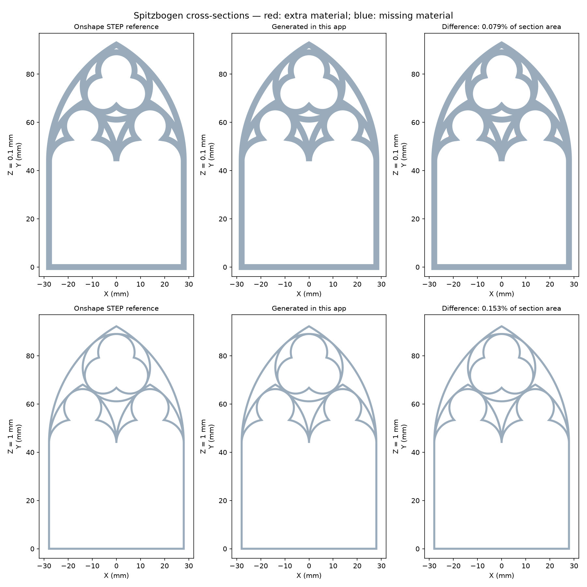

# Spitzbogen: reproducing the Onshape geometry

In **Inputs → Sweep profiles & cusp paths**, choose **Load Onshape Spitzbogen
example**. It loads the original-size paths and the measured stepped profile,
generates a frame-only model, and disables silhouette confinement. STL, 3MF
and SVG slices use the same generated geometry.

## What the reference establishes

The screenshots in `spitzbogen_example` show a profile swept along separately
selected paths using **Pattern & Sweep**, then circular patterns and mirrors.
The [feature author's description](https://forum.onshape.com/discussion/15560/pattern-sweep-new-custom-feature%E2%80%A6)
identifies it as a custom Onshape feature. The supplied STEP archive contains
18 parts, including repeated/mirrored geometry. STEP supplies the finished
surfaces, not the original path selections, constraints or feature code.

The existing `Part Studio 1 - Sketch 3 (2).dxf` matches the reference's path
layout; a copy is included as `examples/spitzbogen/frame.dxf`. Measurements
from the STEP surfaces establish these dimensions:

| Profile feature | Dimension |
| --- | ---: |
| Base width | 2.44 mm |
| Base height | 0.773565523 mm |
| Raised ridge width | 0.84 mm |
| Ridge height above base | 0.6 mm |
| Overall profile height | 1.373565523 mm |

The old `gothic_cnc_wood` project uses a different profile and drawing scale.
Its settings are preserved. Regenerating it fixes the construction; loading
the new example also reproduces the CAD reference's dimensions. Confinement
moves the outside paths inward, so it must be off for comparison with CAD
centreline sweeps.

## Construction in this app

1. Read the DXF paths, deduplicate matching curves, and join compatible
   endpoints. Nearly reversing tangents remain separate capped paths. This
   prevents an unwanted downward spike where the two lower arches meet.
2. Sweep the profile across each path using planar normals and mitred corners.
   Corners allow a mitre ratio of up to four; extreme reversals are capped.
3. For profiles made from horizontal and vertical edges, derive the exact
   height bands from the profile. Build and union the planar sweep ribbons
   at each band, then extrude and fuse the bands. This handles intersecting
   paths without self-intersecting 3D sweep shells. There is no fixed layer
   thickness or approximation of the profile's step heights.
4. For sloped/curved profiles, build individually closed sweeps, remove
   redundant collinear profile vertices, orient the caps and sides, then
   fuse them. Existing independently sized cusp profiles and revolved
   endings remain supported.

Planar coordinates are snapped at a precision suitable for float32 STL
vertices before triangulation; this removes microscopic slivers at tangent
joins. Curves remain polylines with the selected sagitta tolerance. This is
a mesh implementation of the measured construction, not an exact copy of
Onshape's BREP modelling kernel or an editable STEP feature history.

## Validation against the actual STEP parts

The STEP parts were imported with OpenCascade, tessellated at 0.002 mm
deflection, sectioned, and unioned in 2D. Comparing filled cross-sections
counts displaced boundaries, filled holes and extra spikes—not just the
difference in total area. At 0.1 mm and 1.0 mm, the symmetric-difference area
is below 0.2% of the reference section area. The generated STL reloads as
one watertight solid, approximately 58.288 × 94.863 × 1.374 mm.



`tools/fixtures/spitzbogen-sections.json` records the reference sections and
the original archive's SHA-256. `tools/test_profile_sweep.py` compares the
generated STL with those sections and checks caps, intersections and cusp
termination. The normal test suite needs no CAD kernel.

To regenerate the measurements, install optional development packages
`cadquery-ocp` and `vtk` in a separate environment that also has the app's
Python dependencies, then run:

```sh
python tools/measure_step_sections.py \
  'spitzbogen_example/Part Studio 1 (1).zip' \
  tools/fixtures/spitzbogen-sections.json
```

The runtime app does not depend on these additional packages. The measurements
for this change used cadquery-ocp 8.0.1.0.0 and vtk 9.7.1.
